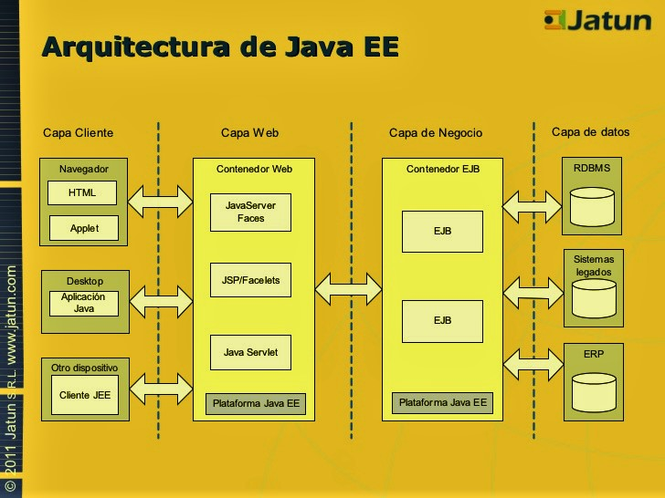
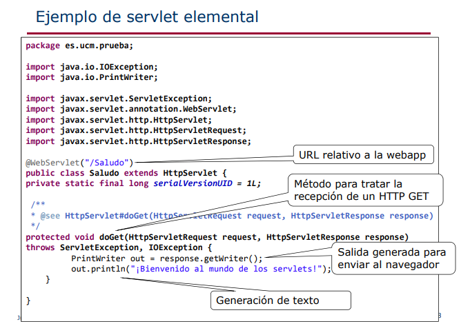
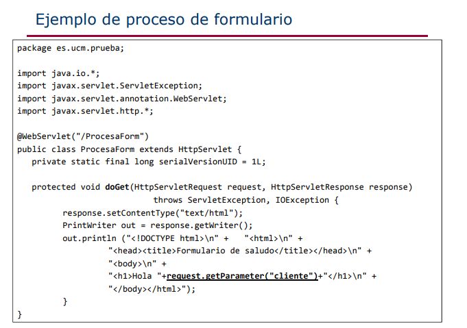
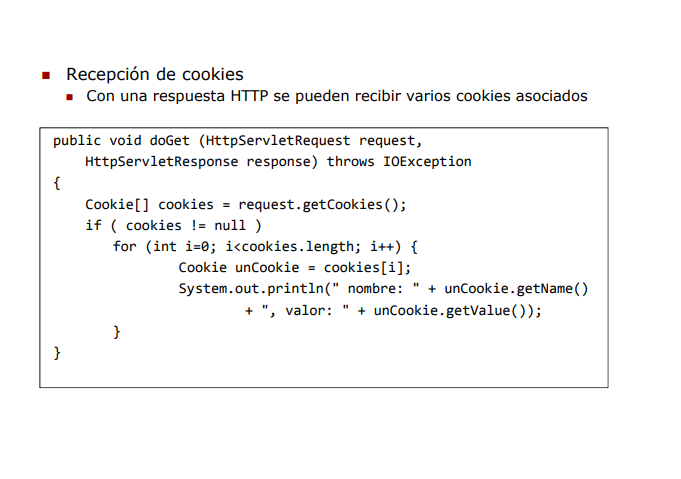

# PRÁCTICA N°1
# SISTEMAS EMPRESARIALES
---
| **Carrera:**             | Ingenieria de Sistemas       |
|--------------------------|------------------------------|
| **Materia:**             | Tecnologías Emergentes II    |
| **Apellidos y Nombres:** | Huanacuni Pari Alex          |
| **C.I:**                 | 8315784 L.P.                 |
| **Lugar y Fecha:**       | El Alto, 06 de Agosto de 2019|
---
1. **Explique que son los sistemas empresariales.**
* Es un sistema que tiene impacto muy importante en el funcionamiento de la programacion o del negocio y cuya falta traeria graves problemas.
2. **Describa cuales son las caracterizticas mas importantes de una aplicacion empresarial.**
* Acceso a bases de datos, usualmente a bases de datos
relacionales
* Operaciones transaccionales, cumple con las propiedades
ACID
* Escalables, permiten escalabilidad vertical y horizontal
* Disponibles, idealmente prestan servicios de forma continua
* Seguras, no todos los usuarios acceden con la misma
funcionalidad
* Permiten integración con otras tecnologías
* Arquitectura multicapa
3. **Investigue y proponga cinco instituciones que requiriran aplicaciones de mision critica.**
* **SEGIP.-** Debe proporsionar estabilidad y escalabilidad, ademas no presentar ninguna perdida de datos. Porque esta institucion es creciente y cambiante.
* **CNS.-** Necesitaria estabilidad y escalabilidad ademas no debera ser flexible para actualizaciones posteriores, tambien requiere seguridad para que solo el personal autorizado pueda acceder a la informacion.
* **BANCOS.-** Requiere maxima seguridad, escalabilidad y debe garantizar el  servicio a sus clientes que necesitan que el servicio este disponibilidad en todo momento 24/7 24 horas los 7 días de la semana.
* **Ministerio de Educacion.-** Precisa estabilidad, escalabilidad como tambien seguridad para los datos que maneja esta institucion donde se registran notas y otros datos importantes.
* **Comercial(Prestamistas)** Estos negocios necesitan seguridad y escalabilidad ademas de flexibilidad para el manejo de sus datos.

4. **Explique cuales son las diferencias entre escalabilidad horizontal y escalabilidad vertical.**
* **Escalabilidad horizontal.-** se entiende a escalabilidad horizontal como al incremento de componentes.
* **Escalabilidad vertical.-** se entiende a escalabilidad vertical a actualizaciones o modernizacion de componentes existentes.
5. **Que es un servidor web y un servidor de aplicaciones.**
* Es un programa informático que procesa una aplicación del lado del servidor, realizando conexiones bidireccionales o unidireccionales y síncronas o asíncronas con el cliente y generando o cediendo una respuesta en cualquier lenguaje o Aplicación del lado del cliente.
* Un servidor de aplicacion es un dispositivo de software que proporcionan servicios de aplicación a las computadoras cliente.
* Generalmente gestiona la mayor parte (o la totalidad) de las funciones de la lógica de negocio y acceso a los datos de la aplicación.
6. **Con un grafico explique como funciona el protocolo HTTP.**

* Este protocolo consiste en reglas sencillas de transferencia de recursos o archivos entre equipos interconectados a una red.
* Al equipo que hace la petición para enviar u obtener datos se le llama Cliente y al que contiene el recurso o el espacio para almacenar es llamado Servidor.
* La comunicación se establece a través de una petición de envío, la cual contiene los datos del cliente, como el sistema operativo que usa, el navegador web desde donde se hace la petición, la ubicación del archivo solicitado (URL), etc.
* Diagrama de una petición y respuesta en el protocolo HTTP
Una petición puede tener múltiples objetivos dependiendo del método que se elija. Los tipos de peticiones más comunes son el Retorno de datos y la Publicación de datos. Técnicamente se les conoce como los métodos GET y POST.
* La búsqueda de una página web a través de la URL es un buen ejemplo de una petición GET, donde el cliente especifica la URL y el servidor retorna en la información HTML necesaria para que el navegador realice su respectivo parsing.

7. **Explique los elementos importantes de REQUEST EN HTTP.**
* **Método HTTP** (la acción a realizar)
* **La página para acceder** (una URL)
* **Parámetros de forma** (como argumentos de un método)

8. **Explique los elementos importantes de RESPONSE EN HTTP.**
* **Un código de estado** (para saber si la solicitud fue exitosa)
* **Tipo de contenido** (texto, imagen, HTML, etc.)
* **El contenido** (el HTML real, la imagen, etc.)

9. **Describe con un grafico la arquitectura JAVA EE.**

* La Arquitectura de Java EE son divididas en cuatro capas: la capa cliente, la capa web,
la capa negocio y la capa datos.

    * **Capa Cliente.- ** Esta capa corresponde a lo que se encuentra en el computador del cliente. Es la interfaz gráfica del sistema y se encarga de interactuar con el usuario.
    * **Capa Web.-** Se encuentra en el servidor web y contiene la lógica de presentación que se utiliza para generar una respuesta al cliente.
    * **Capa Negocio.-** Se encuentra en el servidor de aplicaciones y contiene el núcleo de la lógica del negocio de la aplicación. Provee las interfaces necesarias para utilizar el servicio de componentes del negocio. Las componentes del negocio interactúan con la capa de datos y son típicamente implementadas como componentes EJB.
    * **Capa Datos.-** Esta capa es responsable del sistema de información de la empresa o Enterprise Information System (EIS) que incluye bases de datos, sistema de procesamiento datos, sistemas legados3.2 y sistemas de planificación de recursos. Esta capa es el punto donde las aplicaciones J2EE se integran con otros sistemas no JavaEE o con sistemas legados.
10. **Explique que son los contenedores, componentes, y servicios de JAVA EE.**
* **Contendedores Java EE.-** Un contenedor es un entorno de ejecucion que provee al componente una serie de servicios. Java EE define tipos de contenedores los cuales son:

**Contenedores.** La infraestructura de Java EE se divide en dominios lógicos llamados contenedores. Cada contenedor tiene una función específica, es compatible con un conjunto de APIs, y ofrece servicios a los componentes (seguridad, acceso a bases de datos, manejo de transacción, nombres de directorios, la inyección de recursos). Contenedores ocultar la complejidad técnica y mejorar la portabilidad. Dependiendo del tipo de aplicación que desea construir, usted tendrá que entender las capacidades y limitaciones de cada contenedor con el fin de utilizar uno o más. Por ejemplo, si usted necesita para desarrollar una aplicación web, se desarrollará un nivel de JSF con un nivel de EJB Lite y desplegarlos en un contenedor web. Pero si quieres una aplicación web para invocar una capa de negocio a distancia y el uso de mensajería y llamadas asíncronas, necesitará tanto la web como contenedores EJB. Java EE tiene cuatro recipientes diferentes:

* ***Applet containers*** son proporcionados por la mayoría de los navegadores web para ejecutar los componentes del applet. Al desarrollar applets, puede concentrarse en el aspecto visual de la aplicación, mientras que el recipiente le da un entorno seguro. El contenedor applet utiliza un modelo de seguridad caja de arena donde el código ejecutado en la “caja de arena” no se le permite “jugar fuera de la caja de arena”. Esto significa que el contenedor impide cualquier código descargado en el equipo local accedan a recursos del sistema local, como procesos o archivos.

* ***Application client container*** (ACC) incluye un conjunto de clases Java, bibliotecas y otros archivos necesarios para llevar la inyección, la gestión de la seguridad y el servicio de nombres de aplicaciones Java SE (columpios, el procesamiento por lotes, o simplemente una clase con una principal() método). El ACC se comunica con el contenedor EJB utilizando RMI-IIOP y el contenedor web con HTTP (por ejemplo, para los servicios web).

* ***Web container*** proporciona los servicios subyacentes para la gestión y ejecución de los componentes web (servlets, EJB Lite, JSP, filtros, oyentes, páginas JSF y servicios Web). Es responsable de instanciar, inicialización, e invocando los servlets y el apoyo a los protocolos HTTP y HTTPS. Es el recipiente utilizado para alimentar las páginas web a los navegadores de los clientes.

* ***EJB container*** es responsable de la gestión de la ejecución de los granos de la empresa (beans de sesión y por mensajes) que contiene la capa de lógica de negocio de la aplicación Java EE. Se crea nuevas instancias de EJB, gestiona su ciclo de vida, y ofrece servicios tales como transacciones, la seguridad, concurrencia, distribución, servicio de nombres, o la posibilidad de invocar de forma asíncrona.

**Componentes.** El entorno de ejecución de Java EE define cuatro tipos de componentes que una implementación debe soportar:

* ***Applets*** son GUI (interfaz gráfica de usuario) las aplicaciones que se ejecutan en un navegador web. Ellos usan el API Swing para proporcionar interfaces de usuario de gran alcance.

* ***Applications*** son programas que se ejecutan en un cliente. Por lo general son interfaces gráficas de usuario o batchprocessing programas
que tienen acceso a todas las instalaciones de la capa media de Java EE.

* ***Web applications*** (hecha de servlets, filtros de servlets, los detectores de eventos web, páginas JSP y JSF) se ejecutan en un contenedor web y responder a las solicitudes HTTP de los clientes web. Servlets también soportan SOAP y puntos finales de servicios web RESTful. Las aplicaciones Web pueden contener también EJB Lite.

* ***Enterprise applications*** (hecha de Enterprise Java Beans, Java Message Service, Java Transaction API, llamadas asíncronas, servicio de temporizador, RMI / IIOP) se ejecutan en un contenedor EJB. EJB son componentes gestionados por contenedor para el procesamiento de la lógica del negocio transaccional. Se puede acceder localmente y de forma remota a través de RMI (o HTTP para SOAP y servicios web REST).

**Servicios.** Los contenedores proporcionan servicios subyacentes a sus componentes desplegados. Como desarrollador, contenedores le permiten concentrarse en la implementación de la lógica de negocio en lugar de resolver los problemas técnicos que se plantean en las aplicaciones empresariales. Por ejemplo, la Web y EJB contenedores proporcionan conectores acceder a la EIS, pero no el contenedor applet o los ACC. Java EE ofrece los siguientes
servicios:

* ***Java Transaction API:*** Este servicio ofrece una API de demarcación de transacciones utilizado por el contenedor y la aplicación. También proporciona una interfaz entre el administrador de transacciones y un gestor de recursos a nivel de interfaz de proveedor de servicios (SPI).

* ***Java Persistence API:*** API estándar para el mapeo objeto-relacional (ORM). Con su persistencia Java Query Language (JPQL), se puede consultar objetos almacenados en la base de datos subyacente.

* ***Validation:*** Bean Validation ofrece instalaciones de primera clase y de declaración de restricción a nivel de método y de validación.

* ***Java Message Service:*** Esto permite que los componentes se comunican de forma asíncrona a través de mensajes. Es compatible con la mensajería fiable de punto a punto (P2P), así como el modelo de publicación-suscripción (pub-sub).

* ***Java Naming and Directory Interface:*** Esta API, incluido en Java SE, se utiliza para acceder a la denominación y sistemas de directorio. La aplicación utiliza para asociar (bind) a los nombres de objetos y luego encontrar estos objetos (de búsqueda) en un directorio. Puede buscar fuentes de datos, fábricas JMS, EJB, y otros recursos. Omnipresente en su código hasta J2EE 1.4, JNDI se usa de una manera más transparente a través de la inyección.

* ***JavaMail:*** Muchas aplicaciones requieren la capacidad de enviar mensajes de correo electrónico, que puede implementarse a través del uso de la
API de JavaMail.

* ***JavaBeans Activation Framework:*** La API de JAF, incluido en Java SE, proporciona un marco para el manejo de datos en
diferentes tipos MIME. Es utilizado por JavaMail.

* ***XML processing:*** La mayoría de los componentes de Java EE pueden desplegarse con descriptores de despliegue XML opcionales, y las aplicaciones a menudo tienen que manipular documentos XML. El API Java para Procesamiento de XML (JAXP) proporciona soporte para procesadores de documentos con APIs SAX y DOM, así como para XSLT. La API para XML Transmisión (StAX) proporciona una API de extracción de análisis para XML.

* ***JSON processing:*** Nuevo en Java EE 7 de la API Java para procesamiento JSON (JSON-P) permite a las aplicaciones para analizar, generar, transformar y JSON consulta.

* ***Java EE Connector Architecture:*** Conectores le permiten acceder a EIS de un componente de Java EE. Estas podrían ser las bases de datos, ordenadores centrales, o planificación de recursos empresariales (ERP) programas.

* ***Security services:*** Java Servicio de autenticación y autorización (JAAS) permite a los servicios para autenticar y hacer cumplir los controles de acceso a los usuarios. El contrato de proveedor Java de servicios de autorización de los contenedores (JACC) define un contrato entre un servidor de aplicaciones Java EE y un proveedor de servicios de autorización, permitiendo a los proveedores de servicios de autorización personalizado a ser conectado a cualquier producto Java EE. Servicio de autenticación de Java interfaz de proveedor de los contenedores (JASPIC) define una interfaz estándar por el cual los módulos de autenticación pueden estar integrados con los envases de manera que estos módulos pueden establecer las identidades de autenticación usado por contenedores.

* ***Web services:*** Java EE proporciona soporte para SOAP y servicios web RESTful. La API de Java para servicios web XML (JAX-WS), en sustitución de la JAX-RPC (JAX-RPC), proporciona soporte para servicios web utilizando el protocolo SOAP / HTTP. El JAX-RS (JAX-RS) proporciona soporte para servicios web utilizando el estilo REST.

* ***Dependency Injection:*** Desde Java EE 5, algunos recursos (fuentes de datos, fábricas, unidades de JMS, EJB persistencia...) Se pueden inyectar en componentes administrados. Java EE 7 va más allá mediante el uso de CDI, así como la especificaciones DI (inyección de dependencia para Java).

* ***Management:*** Java EE define las API para la gestión de contenedores y servidores utilizando un grano especial de gestión de la empresa. El (JMX) de la API de Java Management Extensions también se utiliza para proporcionar algo de apoyo a la gestión.

* ***Deployment:*** La implementación de la especificación Java EE define un contrato entre las herramientas de implementación y los productos de Java EE para estandarizar la implementación de aplicaciones.

11. **Investigue los métodos más utilizados de las clases HttpServlet, HttpServletRequest y HttpServletResponse, y para cada uno de los métodos muestre un ejemplo.**

